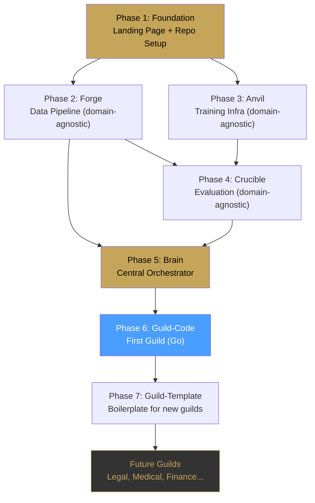

# GuildLM — Specialist Models. Mastered.

> Her alanın bir ustası var. Beyin hepsini yönetiyor.

GuildLM, **her alan için uzmanlaşmış küçük modeller (SLM)** eğitip bunları tek bir **Beyin (Brain)** altında orkestra eden açık kaynak bir platform. "Her şeyi bilen tek dev model" yaklaşımının antitezi.

---

## Büyük Resim

```
                         ┌──────────────┐
                         │    USER      │
                         └──────┬───────┘
                                │
                         ┌──────▼───────┐
                         │  🧠 BRAIN    │
                         │  (Planner)   │
                         │  Routes to   │
                         │  the right   │
                         │  guild       │
                         └──────┬───────┘
                                │
          ┌─────────────────────┼─────────────────────┐
          │                     │                     │
   ┌──────▼──────┐      ┌──────▼──────┐      ┌──────▼──────┐
   │ ⚔️ CODE     │      │ ⚖️ LEGAL    │      │ 🏥 MEDICAL  │
   │   GUILD     │      │   GUILD     │      │   GUILD     │
   │             │      │             │      │             │
   │ Go SLM      │      │ Contract    │      │ Diagnosis   │
   │ React SLM   │      │ Compliance  │      │ Literature  │
   │ SQL SLM     │      │ Case Law    │      │ Drug Inter. │
   │ DevOps SLM  │      │ IP Law      │      │ Radiology   │
   └─────────────┘      └─────────────┘      └─────────────┘
          │                     │                     │
   ┌──────▼──────┐      ┌──────▼──────┐      ┌──────▼──────┐
   │ 💰 FINANCE  │      │ 📚 EDUCATION│      │ 🎨 CREATIVE │
   │   GUILD     │      │   GUILD     │      │   GUILD     │
   │             │      │             │      │             │
   │ Risk Anal.  │      │ Tutor       │      │ Copywriting │
   │ Trading     │      │ Curriculum  │      │ Storytelling│
   │ Compliance  │      │ Assessment  │      │ Translation │
   │ Tax         │      │ Research    │      │ Marketing   │
   └─────────────┘      └─────────────┘      └─────────────┘
```

**Fark:** Tek bir 500B model yerine, her biri 3B–8B olan onlarca uzman. Brain sadece yönlendiriyor — "Bu bir Go kodu mu? Code Guild'e gönder. Bir sözleşme mi? Legal Guild'e."

---

## Core Felsefe

| Prensip | Açıklama |
|:---|:---|
| **Guild System** | Her alan bir "lonca" — içinde birden fazla uzman SLM |
| **Brain First** | Beyin modeli görev tanır, doğru loncaya yönlendirir |
| **Domain Isolation** | Her SLM sadece kendi alanını bilir, diğerlerini bilmez |
| **Composable** | Yeni bir alan eklemek = yeni bir guild eklemek |
| **Local-First** | Tüm sistem tek bir makinede çalışabilmeli |
| **Open Source** | Her şey açık kaynak, community-driven |

---

## User Review Required

> [!IMPORTANT]
> **Scope**: İlk guild olarak **Code Guild (Go)** ile başlıyoruz. Ama altyapı (forge, anvil, crucible, sentinel) tamamen **domain-agnostic** olacak — yani Legal Guild eklemek istediğinde sadece yeni config + dataset + LoRA yeterli olacak. Bu yaklaşım doğru mu?

> [!IMPORTANT]
> **Brain Model**: Brain için iki seçenek var:
> 1. **Mevcut bir genel model kullan** (Qwen3-8B, Llama 3.1) — başlangıç için yeterli
> 2. **Brain'i de özel eğit** — task routing, intent classification, guild selection konusunda uzmanlaştır
> 
> Önerim: Phase 1'de mevcut model, sonra kendi Brain modelimizi eğitelim.

> [!IMPORTANT]
> **GPU Altyapı**: Eğitim için ne kullanacağız? (A100, consumer GPU, cloud?)

---

## Güncellenmiş Repo Yapısı

| Repository | Purpose | Domain |
|:---|:---|:---|
| `guildlm.github.io` | Landing page, docs, guild kataloğu | — |
| `brain` | 🧠 Central orchestrator — task routing, guild selection, multi-guild coordination | Core |
| `forge` | Data pipeline — **any domain** için veri toplama, temizleme, instruction oluşturma | Core |
| `anvil` | Training infra — **any model** için SFT, DPO, LoRA, merge, export | Core |
| `crucible` | Evaluation — **any domain** için benchmark, test, karşılaştırma | Core |
| `guild-code` | ⚔️ İlk lonca: Code SLM'ler (Go, React, SQL, DevOps) — configs, datasets, benchmarks | Guild |
| `guild-template` | 📋 Yeni guild oluşturmak için boilerplate template | Template |

### Neden bu yapı?

```
Core (domain-agnostic)          Guilds (domain-specific)
├── brain/                      ├── guild-code/
├── forge/                      │   ├── go/
├── anvil/                      │   ├── react/
└── crucible/                   │   ├── sql/
                                │   └── devops/
                                ├── guild-legal/     (gelecekte)
                                ├── guild-medical/   (gelecekte)
                                ├── guild-finance/   (gelecekte)
                                └── guild-education/ (gelecekte)
```

**Core tools hiç değişmez** — sadece yeni guild-* repoları eklenir.

---

## Phase 1: Foundation — Landing Page + Core Repos
**Timeline: Week 1**

### `guildlm.github.io` — Landing Page

Premium, dark-themed, brand-identity showcase. Sadece bir tanıtım sayfası değil — **manifestoya** yakın:

- **Hero**: Logo + "Specialist Models. Mastered." + animated guild architecture
- **Problem**: "500B tek model yaklaşımı neden yanlış?" — interactive comparison
- **Solution**: "Guild System" — her alan bir lonca, her lonca ustalar barındırır
- **Guilds Showcase**: Card grid — Code, Legal, Medical, Finance, Education, Creative (coming soon)
- **Architecture**: Interactive SVG diagram — Brain → Guilds → Specialists
- **Roadmap**: Timeline with milestones
- **Open Source**: GitHub links, contributing guide
- **Footer**: Branding, socials

### Core Repo Initialization

Her repo için:
- Professional README with brand logo
- Apache 2.0 license
- Contributing guidelines
- Issue templates
- GitHub Actions CI
- `.gitignore`

---

## Phase 2: Data Pipeline — `forge` (Domain-Agnostic)
**Timeline: Weeks 2–4**

Forge artık sadece kod değil, **herhangi bir alan** için veri topluyor.

### Mimari

```
forge/
├── src/
│   ├── core/                    # Domain-agnostic core
│   │   ├── discoverer.py        # Data source discovery (GitHub, arxiv, etc.)
│   │   ├── downloader.py        # Concurrent content fetcher
│   │   ├── processor.py         # Clean, dedup, validate
│   │   ├── instruction_gen.py   # Q&A pair generation (template-based)
│   │   ├── context_builder.py   # Long-context example builder
│   │   └── dataset_builder.py   # Final JSONL/Parquet export
│   │
│   ├── sources/                 # Pluggable data sources
│   │   ├── github.py            # GitHub repos (code guilds)
│   │   ├── arxiv.py             # Academic papers (research guilds)
│   │   ├── legal_corpus.py      # Legal documents (legal guild)
│   │   ├── pubmed.py            # Medical literature (medical guild)
│   │   └── custom.py            # User-provided data
│   │
│   └── plugins/                 # Domain-specific processors
│       ├── code/                # Code: syntax check, import analysis
│       │   ├── go_processor.py
│       │   ├── react_processor.py
│       │   └── sql_processor.py
│       └── text/                # Text: NER, topic extraction
│           ├── legal_processor.py
│           └── medical_processor.py
│
├── configs/
│   ├── guild_code_go.yaml       # Config for Go data collection
│   └── guild_template.yaml      # Template for new guilds
│
└── pyproject.toml
```

**Key Design**: `forge`'un core'u hiçbir domain bilmez. `sources/` ve `plugins/` ile yeni domain eklenir.

---

## Phase 3: Training — `anvil` (Domain-Agnostic)
**Timeline: Weeks 4–6**

```
anvil/
├── src/
│   ├── train.py                 # SFT trainer (any model, any data)
│   ├── dpo_train.py             # DPO/RLHF trainer
│   ├── data_loader.py           # Universal data loader
│   ├── merge.py                 # LoRA merge + export (HF, GGUF, ONNX)
│   └── quantize.py              # GPTQ, AWQ, GGUF quantization
│
├── configs/
│   ├── base_models/
│   │   ├── qwen3_8b.yaml
│   │   ├── llama_8b.yaml
│   │   └── mistral_7b.yaml
│   │
│   ├── lora/
│   │   ├── default.yaml         # Standard LoRA config
│   │   ├── qlora_consumer.yaml  # QLoRA for consumer GPUs
│   │   └── high_rank.yaml       # High-rank LoRA for complex domains
│   │
│   └── guilds/                  # Per-guild training recipes
│       ├── code_go_generator.yaml
│       ├── code_go_reviewer.yaml
│       └── guild_template.yaml
│
└── pyproject.toml
```

---

## Phase 4: Evaluation — `crucible` (Domain-Agnostic)
**Timeline: Weeks 5–7**

```
crucible/
├── src/
│   ├── runner.py                # Universal eval runner
│   ├── compare.py               # Model comparison & reports
│   ├── report.py                # Markdown/HTML report generator
│   │
│   ├── evaluators/              # Pluggable evaluators
│   │   ├── functional.py        # Run & test (code)
│   │   ├── accuracy.py          # Factual accuracy (knowledge domains)
│   │   ├── quality.py           # Output quality scoring
│   │   ├── safety.py            # Safety & hallucination detection
│   │   └── llm_judge.py         # LLM-as-judge scoring
│   │
│   └── sandboxes/               # Execution environments
│       ├── go_sandbox/          # Docker-based Go execution
│       ├── python_sandbox/      # Python execution
│       └── generic_sandbox/     # Text-based evaluation
│
├── benchmarks/
│   └── guild_code/
│       ├── go_humaneval.jsonl
│       ├── go_review.jsonl
│       └── go_concurrency.jsonl
│
└── pyproject.toml
```

---

## Phase 5: Brain — `brain` 🧠
**Timeline: Weeks 7–9**

Bu en kritik parça. Brain, kullanıcının niyetini anlar ve doğru guild'e yönlendirir.

### Mimari

```
brain/
├── src/
│   ├── brain.py                 # Main brain orchestrator
│   ├── router.py                # Intent → Guild routing
│   ├── planner.py               # Multi-step task decomposition
│   ├── memory.py                # Conversation & context memory
│   ├── guild_registry.py        # Registry of available guilds
│   │
│   ├── protocols/               # Communication protocols
│   │   ├── guild_protocol.py    # Brain ↔ Guild interface
│   │   ├── tool_protocol.py     # Guild ↔ Tool interface
│   │   └── feedback_loop.py     # Review → Fix → Verify loop
│   │
│   ├── model_manager.py         # Load/unload models dynamically
│   │   # - VRAM-aware scheduling
│   │   # - Hot-swap LoRA adapters
│   │   # - Ollama / vLLM / local support
│   │
│   └── cli.py                   # User-facing CLI
│       # guildlm ask "Build me a REST API in Go"
│       # guildlm ask "Review this contract for IP issues"
│       # guildlm ask "Analyze this patient's blood work"
│
├── configs/
│   ├── brain.yaml               # Brain model config
│   ├── guilds/                  # Guild definitions
│   │   ├── code.yaml            # Code guild — members, tools, capabilities
│   │   ├── legal.yaml           # (template for future)
│   │   └── medical.yaml         # (template for future)
│   │
│   └── routing_rules.yaml       # Intent classification rules
│
└── pyproject.toml
```

### Brain Akışı

```
User: "Bu Go kodundaki race condition'ı bul ve düzelt"
  │
  ▼
🧠 Brain.classify()
  → Domain: "code"
  → Language: "go"  
  → Task: "bug_fix"
  → Subtask: "concurrency"
  │
  ▼
🧠 Brain.route()
  → Guild: "code"
  → Specialist: "go_reviewer" (first pass)
  → Then: "go_generator" (fix)
  → Then: "go_reviewer" (verify fix)
  │
  ▼
🧠 Brain.execute()
  1. Load go_reviewer LoRA → Analyze code → Find race condition
  2. Load go_generator LoRA → Generate fix
  3. Run go test (tool) → Verify
  4. Load go_reviewer LoRA → Final review
  5. Return result to user
```

### Brain Multi-Guild Örneği

```
User: "Go ile bir fintech API yaz, KVKK uyumlu olsun"
  │
  ▼
🧠 Brain.plan()
  → Step 1: Code Guild (Go) → API skeleton
  → Step 2: Legal Guild (Compliance) → KVKK requirements check
  → Step 3: Code Guild (Go) → Apply compliance requirements
  → Step 4: Code Guild (Security) → Security audit
  → Step 5: Legal Guild (Review) → Final compliance review
```

---

## Phase 6: First Guild — `guild-code`
**Timeline: Weeks 8–10**

```
guild-code/
├── go/
│   ├── dataset_config.yaml      # Forge config for Go data
│   ├── training_config.yaml     # Anvil config for Go model
│   ├── benchmarks/              # Go-specific benchmarks
│   ├── tools/                   # Go-specific tools (go test, lint, etc.)
│   ├── prompts/                 # System prompts for Go specialists
│   │   ├── generator.txt
│   │   ├── reviewer.txt
│   │   ├── optimizer.txt
│   │   └── security.txt
│   └── examples/                # Usage examples
│
├── react/                       # (Phase 2 — same structure)
├── sql/                         # (Phase 2)
├── devops/                      # (Phase 2)
│
├── guild.yaml                   # Guild manifest
│   # name: code
│   # members: [go, react, sql, devops]
│   # brain_routing_keywords: [code, program, build, debug, deploy...]
│
└── README.md
```

---

## Phase 7: Guild Template — `guild-template`

Yeni guild oluşturmayı trivial hale getiren boilerplate:

```bash
# Yeni guild oluştur
gh repo create guildlm/guild-legal --template guildlm/guild-template
cd guild-legal
# Config'leri doldur, forge'u çalıştır, anvil'de eğit, crucible'da test et
```

---

## Execution Order



---

## Hemen Başlıyorum

Onay aldıktan sonra şu sırayla:

1. ✅ `guildlm.github.io` — Premium landing page (manifesto + architecture)
2. ✅ `brain` — Repo oluştur, core yapı
3. ✅ `forge` — Repo oluştur, domain-agnostic pipeline
4. ✅ `anvil` — Repo oluştur, training infra
5. ✅ `crucible` — Repo oluştur, eval framework
6. ✅ `guild-code` — İlk guild, Go specialist
7. ✅ `guild-template` — Yeni guild boilerplate

---

## Verification Plan

### Automated Tests
- `pytest` for all Python code
- `go test` for Go sandbox runner
- GitHub Actions CI on all repos

### End-to-End Smoke Test
```
User → Brain → Code Guild (Go) → Generate code → Review → Test → Return
```

### Success Criteria

| Metric | Target |
|:---|:---|
| Brain routing accuracy | >95% (correct guild selection) |
| Go HumanEval pass@1 | >70% (vs base ~55%) |
| Guild add time | <1 day (template → working guild) |
| Local VRAM usage | <16GB for Brain + 1 Guild |
| System latency | <10s for single-step tasks |
